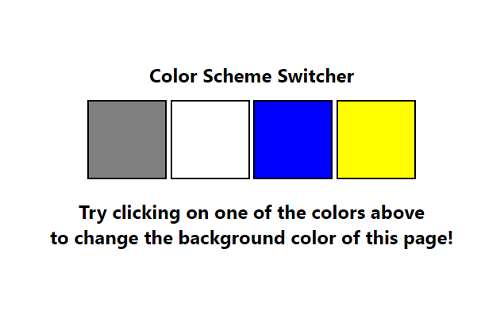
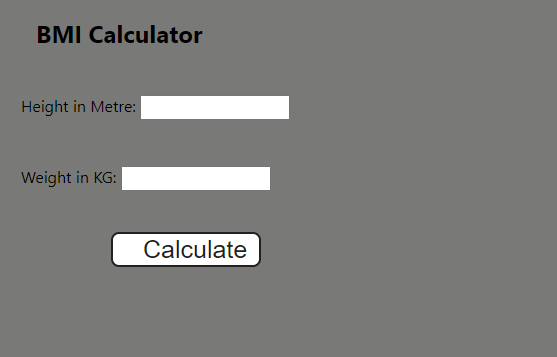
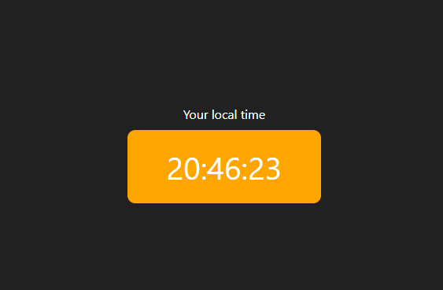
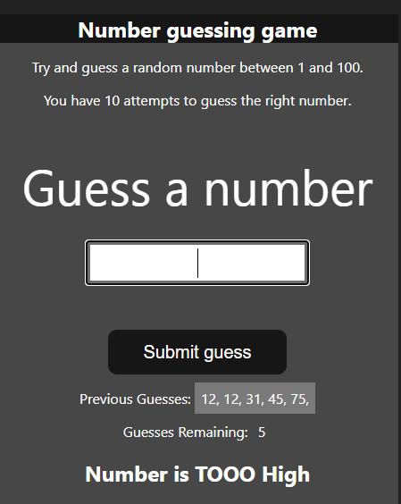

# Projects of JavaScript

### Project Link: 
[🙋‍♂️ Click Here to See](https://stackblitz.com/edit/dom-project-chaiaurcode-lkcsgk?file=1-colorChanger%2Fchaiaurcode.js)

## Project 1: Color Changer


### Code below: 
```javascript
const button = document.querySelectorAll('.button');
const body = document.body;
button.forEach((buttons) => {
  // switch (buttons.id) {
  //   case 'grey':
  //     buttons.addEventListener('click', () => {
  //       body.style.backgroundColor = 'grey';
  //       body.style.color = 'black';
  //     });
  //     break;
  //   case 'white':
  //     buttons.addEventListener('click', () => {
  //       body.style.backgroundColor = 'white';
  //       body.style.color = 'black';
  //     });
  //     break;
  //   case 'blue':
  //     buttons.addEventListener('click', () => {
  //       body.style.backgroundColor = 'blue';
  //       body.style.color = 'white';
  //     });
  //     break;
  //   default:
  //     buttons.addEventListener('click', () => {
  //       body.style.backgroundColor = 'yellow';
  //       body.style.color = 'black';
  //     });
  //     break;
  // }
  buttons.addEventListener('click', (e) => {
    // console.log(e);
    // console.log(e.target);
    // console.log(e.target.id);
    switch (e.target.id) {
      case 'grey':
        body.style.backgroundColor = e.target.id;
        break;
      case 'white':
        body.style.backgroundColor = e.target.id;
        break;
      case 'blue':
        body.style.backgroundColor = e.target.id;
        break;
      case 'yellow':
        body.style.backgroundColor = e.target.id;
        break;
    }
  });
});

```

## Project 2: BMI Calculator


### Code below:
```javascript
const form = document.querySelector('form');
form.addEventListener('submit', (e) => {
  // Stop sending the form anywhere!
  e.preventDefault();

  const height = parseInt(document.getElementById('height').value);
  const weight = parseInt(document.getElementById('weight').value);
  const output = document.getElementById('results');

  if (height === '' || height < 0 || isNaN(height)) {
    output.innerHTML = 'Enter correct height broo';
  } else if (weight === '' || weight < 0 || isNaN(weight)) {
    output.innerHTML = 'Enter correct weight broo';
  } else {
    const bmi = (weight / ((height * height) / 10000)).toFixed(2);
    if (bmi < 18.6){
      output.innerHTML = `${bmi} <br /> UnderWeight`;
    } else if (bmi > 18.6 && bmi < 24.9 ){
      output.innerHTML = `${bmi} <br /> Normal`;
    } else{
      output.innerHTML = `${bmi} <br /> Overweight`;
    }
  }
});

```

## Project 3: Clock

### Code below:
```javascript
const clockBody = document.getElementById('clock');
setInterval(() => {
  let date = new Date();
  clockBody.innerHTML = date.toLocaleTimeString();
}, 1000)
```

## Project 4: Guess the Number


### Code below:
```javascript
let randomNumber = parseInt(Math.random() * 100 + 1);
console.log(randomNumber);
const submit = document.querySelector('#subt');
const userInput = document.querySelector('#guessField');
const guessSlot = document.querySelector('.guesses');
const remaining = document.querySelector('.lastResult');
const lowOrHi = document.querySelector('.lowOrHi');
const startOver = document.querySelector('.resultParas');

const p = document.createElement('p');

let prevGuess = [];
let numGuess = 1;

let playGame = true;

if (playGame) {
  submit.addEventListener('click', function (e) {
    e.preventDefault();
    const guess = parseInt(userInput.value);
    console.log(guess);
    validateGuess(guess);
  });
}

function validateGuess(guess) {
  if (isNaN(guess)) {
    alert('PLease enter a valid number');
  } else if (guess < 1) {
    alert('PLease enter a number more than 1');
  } else if (guess > 100) {
    alert('PLease enter a  number less than 100');
  } else {
    prevGuess.push(guess);
    if (numGuess === 11) {
      displayGuess(guess);
      displayMessage(`Game Over. Random number was ${randomNumber}`);
      endGame();
    } else {
      displayGuess(guess);
      checkGuess(guess);
    }
  }
}

function checkGuess(guess) {
  if (guess === randomNumber) {
    displayMessage(`You guessed it right`);
    endGame();
  } else if (guess < randomNumber) {
    displayMessage(`Number is TOOO low`);
  } else if (guess > randomNumber) {
    displayMessage(`Number is TOOO High`);
  }
}

function displayGuess(guess) {
  userInput.value = '';
  guessSlot.innerHTML += `${guess}, `;
  numGuess++;
  remaining.innerHTML = `${11 - numGuess} `;
}

function displayMessage(message) {
  lowOrHi.innerHTML = `<h2>${message}</h2>`;
}

function endGame() {
  userInput.value = '';
  userInput.setAttribute('disabled', '');
  p.classList.add('button');
  p.innerHTML = `<h2 id="newGame">Start new Game</h2>`;
  startOver.appendChild(p);
  playGame = false;
  newGame();
}

function newGame() {
  const newGameButton = document.querySelector('#newGame');
  newGameButton.addEventListener('click', function (e) {
    randomNumber = parseInt(Math.random() * 100 + 1);
    prevGuess = [];
    numGuess = 1;
    guessSlot.innerHTML = '';
    remaining.innerHTML = `${11 - numGuess} `;
    userInput.removeAttribute('disabled');
    startOver.removeChild(p);

    playGame = true;
  });
}

```